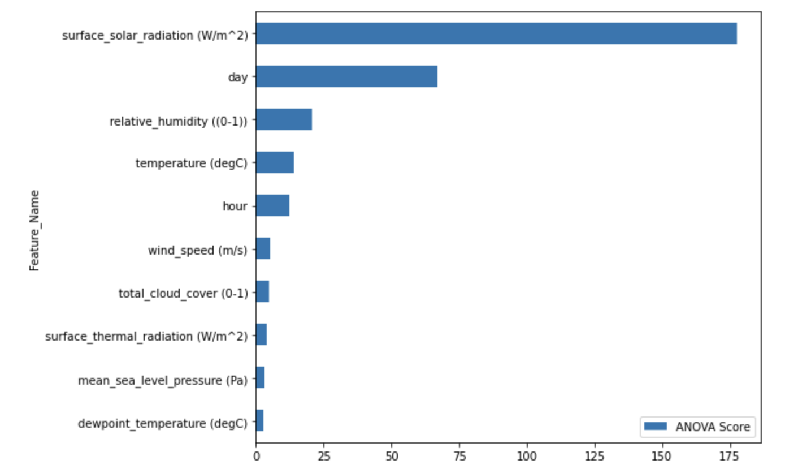
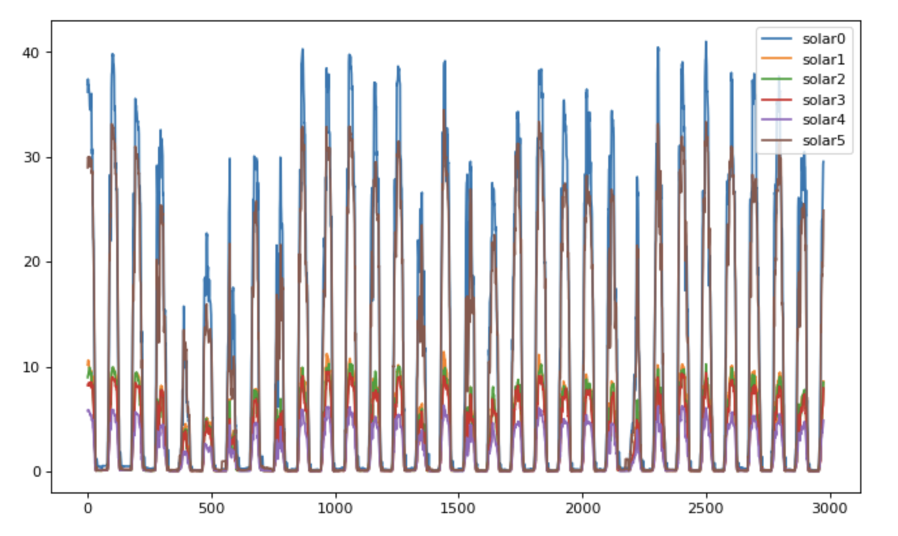

# ☀️ Monash Solar Energy Forecasting

This repository contains my Python project for analyzing and forecasting solar energy generation at Monash using weather data and machine learning. The project combines **time series preparation**, **feature selection**, **weather integration**, and **Random Forest regression** to predict solar panel output and understand which environmental factors most influence solar generation.

---

## 📌 Introduction

This project focuses on forecasting solar energy production using Python and machine learning.

The notebook integrates historical Monash solar panel data with ERA5 weather observations, then builds predictive models to estimate solar generation for multiple panels. The analysis also investigates which weather and time-based features are most important for solar output.

This project demonstrates practical skills in:

- time series data preparation
- weather and energy data integration
- missing value handling
- feature selection
- regression modelling
- model evaluation
- solar energy forecasting

---

## 💡 Motivation

Solar energy output depends strongly on environmental conditions such as solar radiation, temperature, humidity, and cloud cover. Accurate forecasting can help improve planning, monitoring, and energy management.

The goal of this project is to:

- combine solar panel and weather data into a unified modelling dataset
- identify which variables are most predictive of solar output
- build machine learning models for individual solar panels
- compare model accuracy across multiple panels
- visualize predicted solar generation patterns over time

This project shows how machine learning can be applied to renewable energy forecasting using real weather and production data.

---

## 📂 Dataset Description

The project uses multiple datasets, including:

- `phase_1_data.tsf`
- `phase_2_data.tsf`
- `nov_data.tsf`
- `ERA5_Weather_Data_Monash.csv`
- `October Energy Demand and Price.csv`

The time series data includes:

- building energy series
- solar panel output series (`solar0` to `solar5`)

The weather dataset includes variables such as:

- `temperature (degC)`
- `dewpoint_temperature (degC)`
- `relative_humidity ((0-1))`
- `surface_solar_radiation (W/m^2)`
- `surface_thermal_radiation (W/m^2)`
- `total_cloud_cover (0-1)`
- `wind_speed (m/s)`
- `mean_sea_level_pressure (Pa)`

Additional time-based features were also created:

- `hour`
- `day` (daylight indicator)

These variables were used to predict solar panel output.

---

## 🧪 Tools and Libraries Used

This project was built using:

- **Python**
- **Pandas**
- **NumPy**
- **Matplotlib**
- **scikit-learn**

Main modelling tools include:

- `SelectKBest`
- `LinearRegression`
- `RandomForestRegressor`
- `train_test_split`
- `r2_score`

These libraries were used for data transformation, feature selection, regression modelling, and evaluation.

---

## 🧹 Data Preparation

Before modelling, the notebook performs several preprocessing steps:

### 1. Convert `.tsf` series data into DataFrames
The time series files are converted into structured DataFrames using a helper function and then expanded into timestamp-indexed tables.

### 2. Build timestamped solar and building series
Each building and solar panel series is assigned a datetime index using 15-minute intervals, allowing all time series to be aligned consistently.

### 3. Merge weather data with solar data
The ERA5 weather dataset is resampled to 15-minute intervals and interpolated, then merged with the solar output dataset by timestamp.

### 4. Remove unused columns
Metadata columns from the weather dataset are dropped, leaving only useful modelling variables.

### 5. Create time-based features
Two additional variables are generated:

- `hour`
- `day` (1 for daylight hours, 0 otherwise)

These features help capture the daily solar cycle.

### 6. Handle missing and low-output values
The notebook removes missing and unusable values, especially rows where solar output is too low or invalid for model training.

### 7. Create separate datasets for each solar panel
For panel-level modelling, the dataset is split into versions focused on individual solar outputs such as:

- `solar0`
- `solar1`
- `solar2`
- `solar3`
- `solar4`
- `solar5`

---

## 🔍 Feature Selection

The project applies **ANOVA feature selection** using `SelectKBest` to rank the importance of weather and time-based variables for predicting solar output.

The analysis shows that the most influential variables include:

- `surface_solar_radiation (W/m^2)`
- `day`
- `relative_humidity ((0-1))`
- `temperature (degC)`
- `hour`

This confirms that solar radiation and daylight timing are the dominant drivers of solar generation.

---

## 🤖 Modelling Approach

The project explores two main regression approaches:

### 1. Linear Regression
Linear regression is tested first to examine baseline predictive performance across different numbers of selected variables.

### 2. Random Forest Regressor
Random Forest models are then trained and evaluated, producing substantially stronger results than linear regression.

The notebook evaluates model performance using **adjusted R²** and **R² scores**, and compares results as the number of selected features increases.

---

## 📊 Model Performance

Random Forest models consistently outperform linear regression for this problem.

### Solar panel forecasting accuracy
For the six solar panels, the Random Forest models achieved the following approximate R² scores:

- `solar0`: **0.910**
- `solar1`: **0.912**
- `solar2`: **0.912**
- `solar3`: **0.870**
- `solar4`: **0.912**
- `solar5`: **0.925**

These results suggest that the weather and time-based features are highly effective for predicting solar panel output, especially for panels `solar0`, `solar1`, `solar2`, `solar4`, and `solar5`.

---

## 📊 Key Visualisations

### 1. ANOVA Feature Importance



This chart ranks the predictors used in the solar forecasting model based on ANOVA scores. The most important feature is **surface solar radiation**, followed by **daylight indicator (`day`)**, **relative humidity**, **temperature**, and **hour**. This aligns well with real-world expectations, since solar output is naturally driven by sunlight intensity and time of day.

### 2. Predicted Solar Output for All Panels



This line plot shows the predicted solar generation across six solar panels. All panels follow a similar cyclical daily pattern, with output rising during daylight hours and falling close to zero overnight. The different peak heights suggest that the panels have different production capacities, but they still respond consistently to the same weather and daylight conditions.

---

## 📈 Main Insights

The project reveals several important insights:

- **surface solar radiation** is the strongest predictor of solar output
- **daylight timing** is also highly influential
- weather variables such as **humidity**, **temperature**, and **wind speed** contribute useful predictive information
- Random Forest performs much better than linear regression for this forecasting problem
- the six solar panels follow similar daily production patterns, but differ in peak generation levels
- machine learning can produce strong panel-level forecasts when weather and time variables are combined

Overall, the project shows that weather-driven machine learning models are effective for solar energy forecasting.

---

## 🛠️ Techniques Used

This project demonstrates the use of:

- time series conversion from `.tsf`
- datetime indexing
- resampling and interpolation
- merging datasets by timestamp
- feature engineering
- missing value filtering
- `SelectKBest`
- ANOVA feature ranking
- `LinearRegression()`
- `RandomForestRegressor()`
- `train_test_split()`
- `r2_score()`
- Matplotlib visualisations

---

## 📁 Files

- `Monash_Solar.ipynb` – Jupyter notebook containing the full solar forecasting workflow
- `phase_1_data.tsf` – phase 1 time series data
- `phase_2_data.tsf` – phase 2 time series data
- `nov_data.tsf` – November time series data
- `ERA5_Weather_Data_Monash.csv` – weather dataset used for forecasting
- `October Energy Demand and Price.csv` – additional energy demand and price dataset
- `Screenshot 2026-04-09 at 10.15.14 pm.png` – feature importance visualisation
- `Screenshot 2026-04-09 at 10.15.32 pm.png` – predicted solar output visualisation

---

## ▶️ How to Run the Project

1. Open the notebook in **Jupyter Notebook**, **JupyterLab**, or **VS Code**
2. Make sure all required data files are in the same working directory
3. Install the required libraries if needed:

```python
pip install pandas numpy matplotlib scikit-learn
